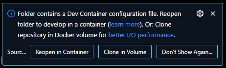
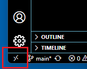

# Build Matter with Visual Studio Code and Docker running on Windows 11
### Author: [Olav Tollefsen](https://www.linkedin.com/in/olavtollefsen/)

## Introduction

This article will walk through how to setup a Matter build environment on a Windows 11 PC using Visual Studio Code and Docker

## Install Git

Install Git from https://git-scm.com/

## Enable the Windows Subsystem for Linux (WSL)

Enable the Windows Subsystem for Linux (WSL) following instructions here: https://learn.microsoft.com/en-us/windows/wsl/install

## Install Docker

Install Docker for your operating system of choice from here: https://docs.docker.com/engine/install

## Enable long paths on Windows 11

Create a file named "EnableLongPaths.reg" with the following content and save it:

```
Windows Registry Editor Version 5.00

[HKEY_LOCAL_MACHINE\SYSTEM\CurrentControlSet\Control\FileSystem]
"LongPathsEnabled"=dword:00000001
```

Run the file by double clicking on it.

## Enable long paths in git

Run the following git command

```
$ git config --global core.longpaths true
```

Enable git to use LF instead of CLRF by default

```
$ git config --global core.longpaths true
```

## Clone the Matter Git Repository

Open Visual Studio Code and clone the main Matter Git repository from Github: project-chip/connectedhomeip

## Install the Dev Containers extension for Visual Studio Code

This extension allows you to use docker containers as a development backend.

https://marketplace.visualstudio.com/items?itemName=ms-vscode-remote.remote-containers

## Install WSL extension for Visual Studio Code

The WSL extension lets you use VS Code on Windows to build Linux applications that run on the Windows Subsystem for Linux (WSL).

## Restart Visual Studio Code

Restart Visual Studio code and open the connectedhomeip folder.

## Reopen in Container

You should now get this message in the lower rigth corner of Visual Studio Code:



Click on "Reopen in Container

If you don't see the message, you can do the following:

Click on the Open Remote Window icon in the bottom left corner of Visual Studio Code:



Click on "Reopen in Container
